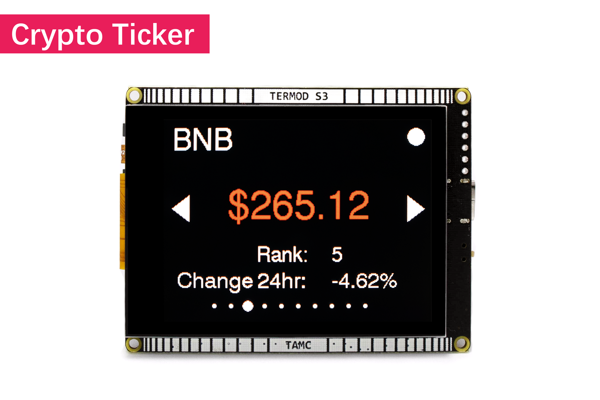
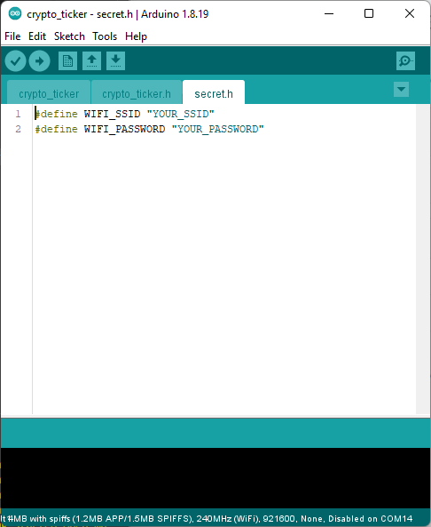

Crypto Ticker
=================================

This example have 10 crypto currencies to the display. Cycle through them by pressing the triangle button.

Data from `Coin Cap API <https://docs.coincap.io/>`_

.. note::

    If you haven't download the code:

    .. include:: ../download-code.txt

Open ``termod-s3/examples/crypto_ticker/crypto_ticker.ino`` with Arduino IDE.

As it require internet connection, you need to change the ssid and password to connect to your wifi network under ``secret.h``.

    
Remember to select ``TAMC Termod S3`` and port, then click upload.

`Source code <https://github.com/TAMCTec/termod-s3/tree/main/examples/crypto_ticker>`_

.. tabs::

    .. tab:: crypto_ticker.ino

        .. include:: ../../../../examples/crypto_ticker/crypto_ticker.ino
            :code: cpp

    .. tab:: crypto_ticker.h

        .. include:: ../../../../examples/crypto_ticker/crypto_ticker.h
            :code: cpp

    .. tab:: secret.h

        .. include:: ../../../../examples/crypto_ticker/secret.h
            :code: cpp
