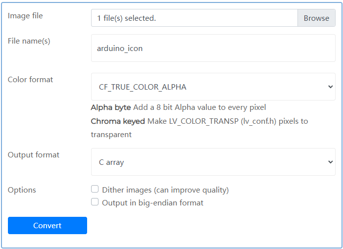

Macro Pad
=================================

Tutorial
------------------------

This example shows how to use Termod S3 as a macro pad.

We use LVGL to make beautiful UI. Here also uses ``lv_helper``

.. note::

    If you haven't download the code:

    .. include:: ../download-code.txt

Open ``termod-s3/examples/macro_pad/macro_pad.ino`` with Arduino IDE.

This example use a 22px font ``LV_FONT_MONTSERRAT_22``, you need to enable it in ``lv_conf.h``, the conf file mentioned in :ref:`install_lvgl`.

Open the file, and find the following code, change the 0 to 1 to enable the font.

.. code-block:: cpp

    #define LV_FONT_MONTSERRAT_22 1

**Make Sure** that **USB Mode** is set to **USB OTG** under **Tools**, and remember to select ``TAMC Termod S3`` and port, then click upload.

Make Icons
---------------

To make your own icons, get a picture, better be a png with transparent background, resize it to about 50x50, then use `lvgl online image converter <https://lvgl.io/tools/imageconverter>`_
to convert it to C array.

Set the output name, it will be the name of the image data variable, so make it "code friendly". Set Color format to ``CF_TRUE_COLOR_ALPHA`` and output to ``C array``. Click ``Convert``, it will download a ``.c`` file.

Then, copy the file to your project, and change the first few line, or it will raise compile error ``fatal error: lvgl/lvgl.h: No such file or directory``

.. code-block:: cpp

    #if defined(LV_LVGL_H_INCLUDE_SIMPLE)
    #include "lvgl.h"
    #else
    #include "lvgl/lvgl.h"
    #endif

To

.. code-block:: cpp

    #include "lvgl.h"

Now add a line to ``.ino`` file to declare it.

.. code-block:: cpp

    LV_IMG_DECLARE(<name>);

That's it, you can now use it to create a button:

.. code-block:: cpp

    createIconButton(&<name>, 0, 0, <onPressed>, <onReleased>, <onTap>);

You can see all above in the example for a reference.

Create a shortcut
-----------------------

Some Apps have a keyboard shortcut like ``CONSUMER_CONTROL_CALCULATOR``. You can launch it with ``ConsumerControl``. Others you need to create a keyboard shortcut,
and simulate the shortcut with Termod S3.

For Windows 10 and 11, you can make a keyboard shortcut to a desktop shortcut. First, create a shortcut of a app to desktop. Then, right click the shortcut, click ``Properties``.

You will see a shortcut options, click on it and press a shortcut key, like ``Ctrl+Alt+Shift+1``. Then click ``Apply`` and ``OK``.

Then in code, simulate it like in the example ``openKicad``.

.. code-block:: cpp

    void openKicad(_lv_event_t* event) {
        Keyboard.press(KEY_LEFT_CTRL);
        Keyboard.press(KEY_LEFT_ALT);
        Keyboard.press(KEY_LEFT_SHIFT);
        Keyboard.press('1');
        Keyboard.releaseAll();
    }

You can change keys.

- To control keyboard, use ``Keyboard``, checkout all keys under `USBHIDKeyboard.h <https://github.com/espressif/arduino-esp32/blob/master/libraries/USB/src/USBHIDKeyboard.h>`_
- To control volume and music, use ``ConsumerControl``, checkout all controls under `USBHIDConsumerControl.h <https://github.com/espressif/arduino-esp32/blob/master/libraries/USB/src/USBHIDConsumerControl.h>`_

`Source code <https://github.com/TAMCTec/termod-s3/tree/main/examples/macro_pad>`_

.. tabs::

    .. tab:: macro_pad.ino

        .. include:: ../../../../examples/macro_pad/macro_pad.ino
            :code: cpp

    .. tab:: lv_helper.cpp

        .. include:: ../../../../examples/macro_pad/lv_helper.cpp
            :code: cpp

    .. tab:: lv_helper.h

        .. include:: ../../../../examples/macro_pad/lv_helper.h
            :code: cpp
