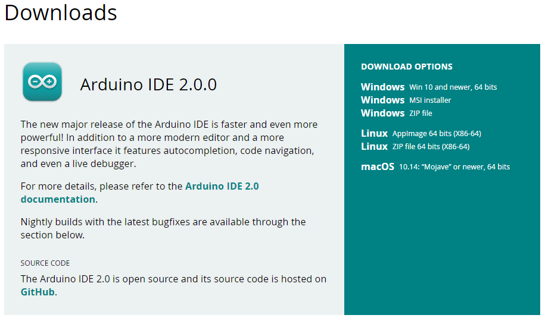
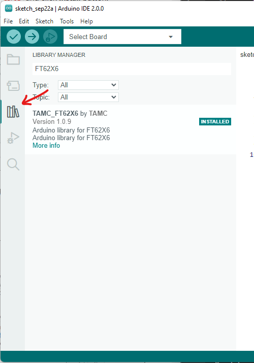
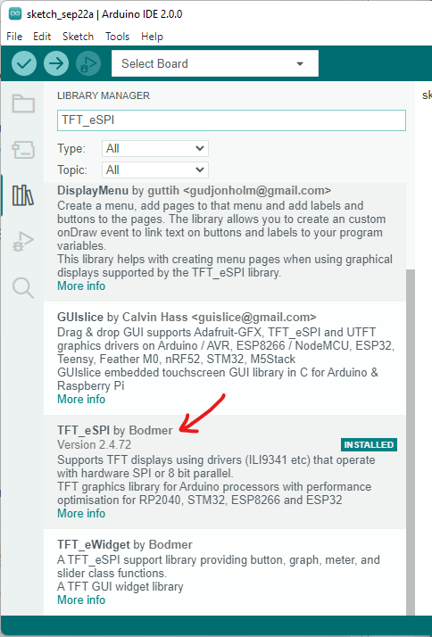
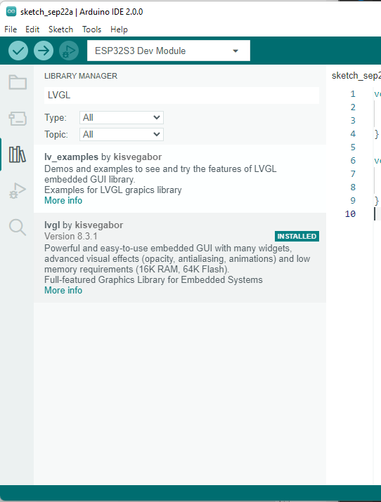

Getting Started with Arduino
=============================

Download Arduino IDE
------------------------

.. note:: If you already installed Arduino IDE, skip this step. This tutorial is based on Arduino IDE 2.0.0, if yours is older, it is recommended to update.

1. Turn to `Arduino IDE download page`_, download and install Arduino IDE.

Add ESP32 Series
------------------------

.. note:: If you have already added the latest ESP32 core, skip this step, or update it to the latest.

Open Arduino IDE. Click top left **File** menu, select **Preference**. Or for Mac, Click **Arduino** menu, select **Preference**.

.. image:: images/arduino-usage-getting-started-open-preference.png

On **Preference** page, click the right-most icon at line **Additional Boards Manager URLS**.

On **Additional Boards Manager URLS** page, Past the link 

    https://raw.githubusercontent.com/espressif/arduino-esp32/gh-pages/package_esp32_index.json

and Click **OK**

Close **Preference** window, Click Board Manager icon on the left

.. image:: images/arduino-usage-getting-started-open-boards-manager.png

On **Boards Manger** side bar, search for ``ESP32`` and click **Install** button. Or update it if it's not the latest version.

.. image:: images/arduino-usage-getting-started-open-boards-manager-install.png

Install FT62X6 Library
------------------------

This is a library for touch screen.

Open Arduino IDE. Click Library Manager icon on the left, search for ``TAMC_FT62X6`` and click **Install** button. Or update it if it's not the latest version.
    

Install TFT_eSPI Library
------------------------

This is a library for TFT display. There are also other options, but we recommand this one.

**Install**

Search again for ``TFT_eSPI`` and click **Install** button. Or update it if it's not the latest version.
    

**Setup for TAMC Termod S3**

After install TFT_eSPI Library, open File Explorer and go to Arduino library folder. Usually is under the following folders. If not, checkout **Sketchbook location** in **Preference** of Arduino IDE.

- For Windows: ``C:\Users\<USER>\Documents\Arduino\libraries``
- For Mac: ``/Users/<USER>/Documents/Arduino/libraries``
- For Linux: ``/home/<USER>/Documents/Arduino/libraries``

Open ``TFT_eSPI`` folder, and open ``User_Setup_Select.h`` file with the editor you like.

Comment out the line: ``#include <User_Setup.h>``, and uncomment the line: ``#include <User_Setups/Setup300_TAMC_Termod_S3.h>``, and the file will look like this:

.. code-block:: cpp
    :linenos:

    ...

    // #include <User_Setup.h>

    ...

    #include <User_Setups/Setup300_TAMC_Termod_S3.h>

    ...

Save and close the file. Download Termod S3 setup and copy it to `User_Setups` folder.

:download:`Setup300_TAMC_Termod_S3.h <https://raw.githubusercontent.com/TAMCTec/termod-s3/main/Setup300_TAMC_Termod_S3.h>`

Done, but no need to close the File Explorer yet, you will need it later.

.. _install_lvgl:

Install LVGL Library (Optional)
-----------------------------------------

`LVGL <https://lvgl.io/>`_ is an amazing GUI library, makes it easy to build modern UI.

.. warning::

    Termod S3 uses SPI display, has not enough refresh rate to perfactly support LVGL. There will be some tearing when scrolling.

**Install**
  
On **Library Manager** tab, search for ``LVGL``. Checkout if the version is 8.3.1, and click **INSTALL**. If not, select the version and click **INSTALL**.

.. note:: Why not the latest version? Because Termod S3 examples are develop under 8.3.1, and LVGL is under heavy development, there may be some breaking changes between versions. If you know what you are doing, you can try the latest version.

**Setup LVGL**

After install LVGL Library, open File Explorer and go to Arduino library folder. Usually is under the following folder.

- For Windows: ``C:\Users\<USER>\Documents\Arduino\libraries``
- For Mac: ``/Users/<USER>/Documents/Arduino/libraries``
- For Linux: ``/home/<USER>/Documents/Arduino/libraries``

Open ``lvgl`` folder, and copy ``lv_conf_template.h`` file to Arduino library folder, alongside lvgl folder, not under lvgl. Like this:

Then, rename it to ``lv_conf.h``, open it with your favorate editor, and change first non-comment line ``if 0`` to ``if 1``.

.. code-block:: cpp

    /**
     * @file lv_conf.h
     * Configuration file for v8.3.1
     */

    /*
     * Copy this file as `lv_conf.h`
     * 1. simply next to the `lvgl` folder
     * 2. or any other places and
     *    - define `LV_CONF_INCLUDE_SIMPLE`
     *    - add the path as include path
     */

    /* clang-format off */
    #if 1 /*Set it to "1" to enable content*/

    #ifndef LV_CONF_H
    #define LV_CONF_H

    #include <stdint.h>

    /*====================
       COLOR SETTINGS
     *====================*/

    /*Color depth: 1 (1 byte per pixel), 8 (RGB332), 16 (RGB565), 32 (ARGB8888)*/
    #define LV_COLOR_DEPTH 16

    /*Swap the 2 bytes of RGB565 color. Useful if the display has an 8-bit int

This file contains the configuration options for LVGL. You can find more information about the options in the `Configuration Reference <https://docs.lvgl.io/latest/en/html/overview/configuration.html>`_. And done for LVGL setup.

Build and upload
---------------------

Now everything is ready to build and upload. Make sure **Board** is set to ``ESP32S3 Dev Module``.

.. warning:: You may see there's a TAMC Termod S3 board in the list, but it's not ready yet, don't use it as for esp32 core v2.0.5, will fix it in the next version.

.. image:: images/arduino-usage-getting-started-build-upload-select-board.png

.. warning:: You may notice there's a more easier way to select both port and device there in the new 2.0. But it's kinda problematic, board recognition may be not resulting the correct board, and it's not easy to select the correct port. So we recommand to use the old way.

.. include:: download-code.txt

Open the downloaded folder, turn to examples, choose one example, and open it with Arduino IDE. Checkout more on :ref:`arduino-examples`.

.. _Arduino IDE download page: https://www.arduino.cc/en/software