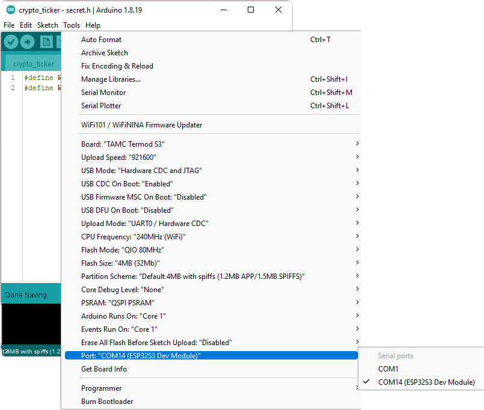
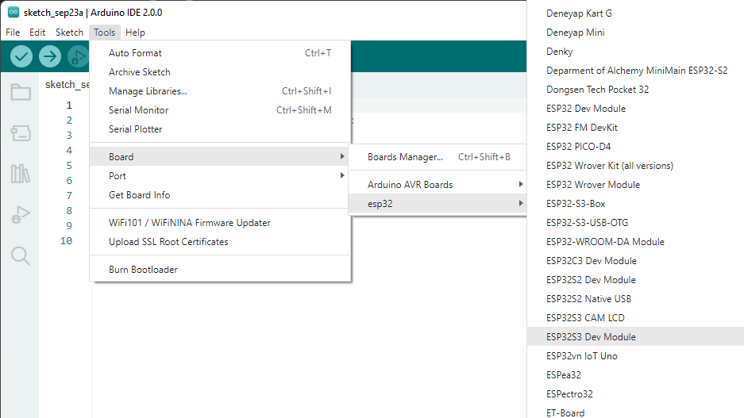

.. _faq:

FAQ
=======================

Error opening serial port 'COM15'.
--------------------------------------------

Make sure you have choose the coresponding port under **Tools** => **Port**, the port wil have a (ESP32 Dev Module) after it.

XXXX is not defined
--------------------------------------------

if something like these is not defined:

- ``BAT_LV``
- ``CHG``
- ``TFT_CS``
- ``TFT_DC``
- ``TFT_RST``
- ``TFT_BCKL``
- ``SD_CS``
- ``SD_CD``
- ``DISPLAY_PORTRAIT``
- ``DISPLAY_LANDSCAPE``
- ``DISPLAY_PORTRAIT_FLIP``
- ``DISPLAY_LANDSCAPE_FLIP``
- ``DISPLAY_WIDTH``
- ``DISPLAY_HEIGHT``
- ``getBatteryVoltage``
- ``getBatteryCapacity``
- ``getChargingState``
- ``setOnChargeStart``
- ``setOnChargeEnd``

Make sure you have select ``TAMC Termod S3`` under **Tools** => **Board**.

