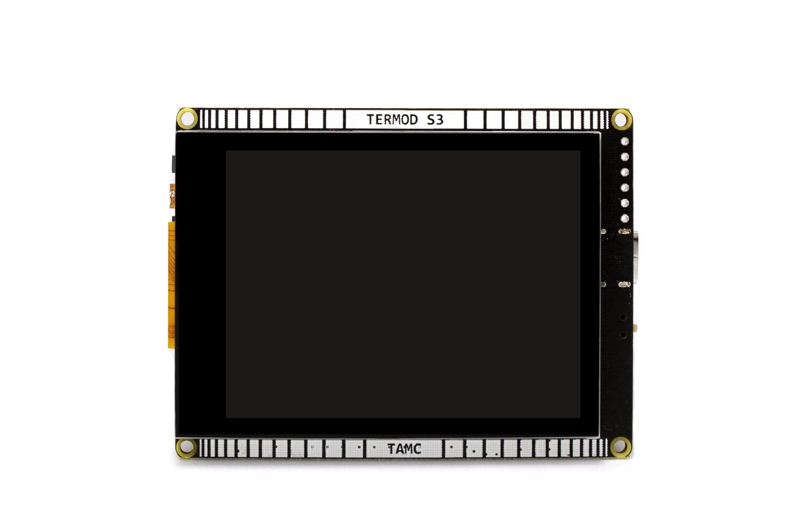
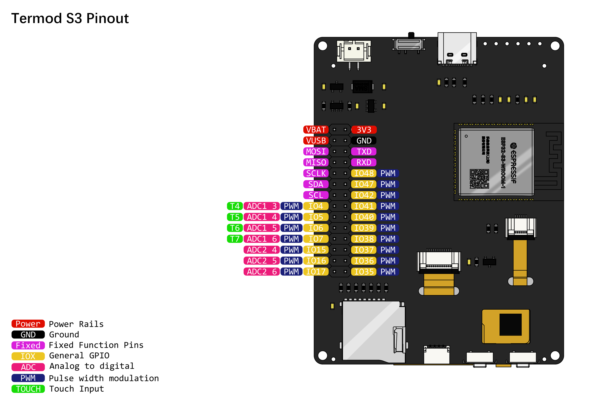
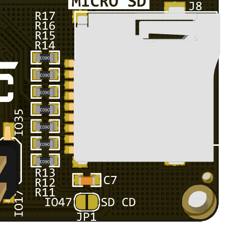
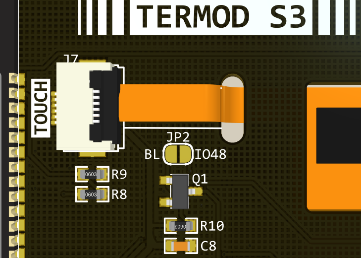
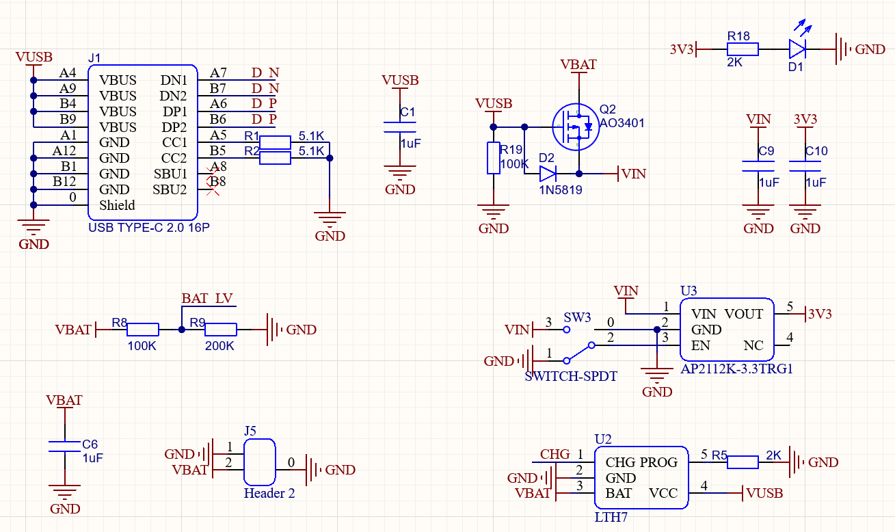
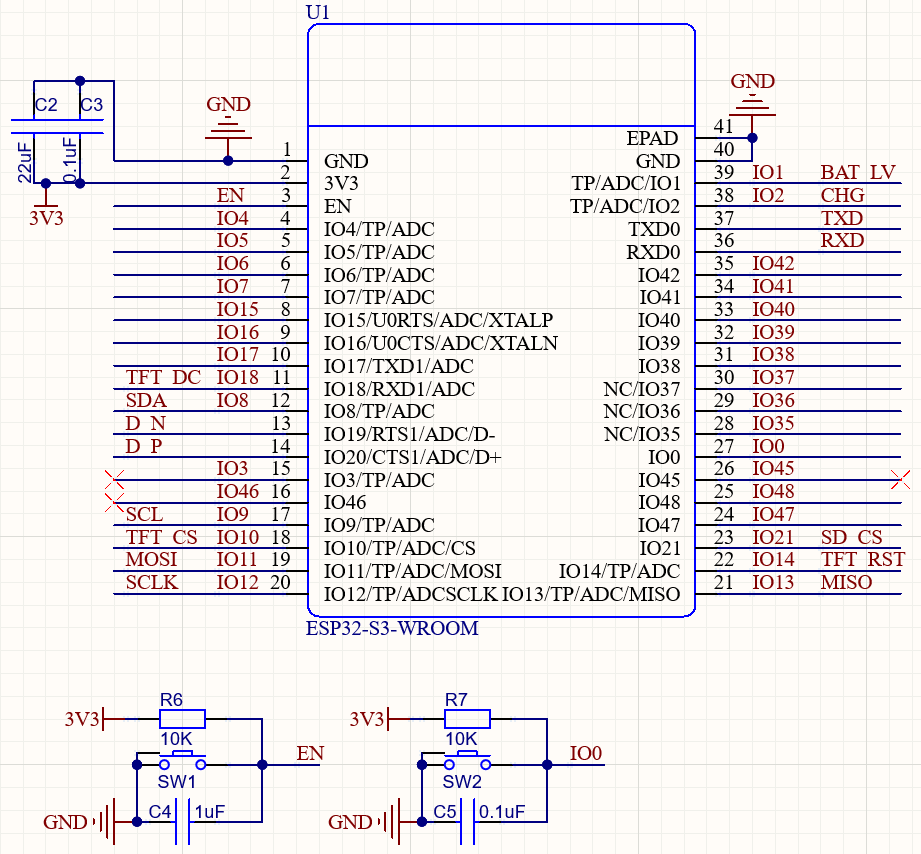
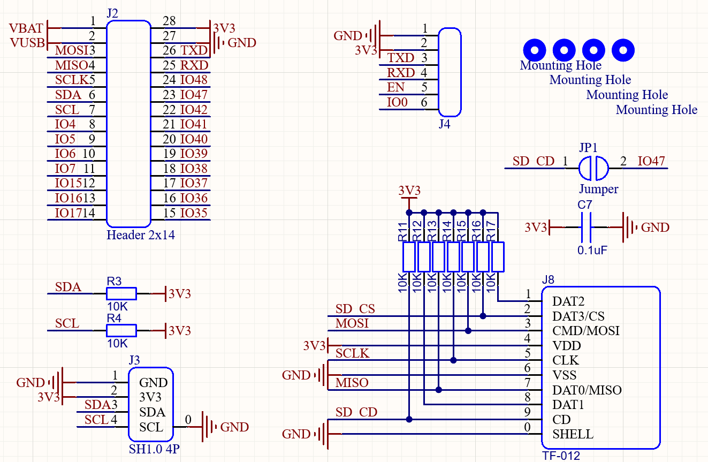
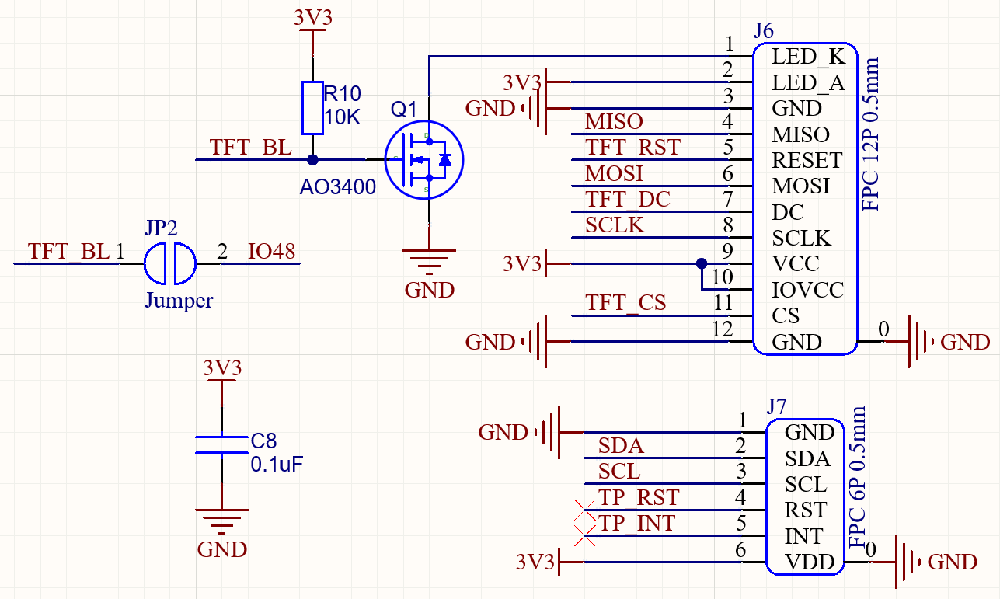

.. _hardware:

Hardware
====================================

Specifications
---------------

.. image:: ./images/termod-s3-functions-notitle.png

.. table::

   +----------------+-----------------------------------+
   | Power          | PH2.0 2P, 3.3V-6V, Min 3.55V@600mA|
   +----------------+-----------------------------------+
   | USB            | USB 2.0 Type-C, PD 5V             |
   +----------------+-----------------------------------+
   | MCU            | ESP32 S3                          |
   +----------------+-----------------------------------+
   | Flash          | 8MB                               |
   +----------------+-----------------------------------+
   | PSRAM          | 2MB                               |
   +----------------+-----------------------------------+
   | Display        | 2.8 Inch 320x240 IPS, SPI         |
   +----------------+-----------------------------------+
   | Touch          | FT6206 Capacitive IIC             |
   +----------------+-----------------------------------+
   | Size           | 76x58mm                           |
   +----------------+-----------------------------------+
   | Mounting Holes | M2 x 4                            |
   +----------------+-----------------------------------+

Pinout
------------------------------------

Pin Assignment
------------------------------------

General Pins

.. table::
  
    +-----------+-----------------------------------------+
    | ESP32 S3  | General                                 |
    +===========+=========================================+
    | GPIO11    | MOSI                                    |
    +-----------+-----------------------------------------+
    | GPIO13    | MISO                                    |
    +-----------+-----------------------------------------+
    | GPIO12    | SCLK                                    |
    +-----------+-----------------------------------------+
    | GPIO8     | SDA                                     |
    +-----------+-----------------------------------------+
    | GPIO9     | SCL                                     |
    +-----------+-----------------------------------------+
    | GPIO1     | Battery Level                           |
    +-----------+-----------------------------------------+
    | GPIO2     | Charge Detect                           |
    +-----------+-----------------------------------------+
    | GPIO0     | Button                                  |
    +-----------+-----------------------------------------+
    | GPIO10    | TFT CS                                  |
    +-----------+-----------------------------------------+
    | GPIO18    | TFT D/C                                 |
    +-----------+-----------------------------------------+
    | GPIO14    | TFT Reset                               |
    +-----------+-----------------------------------------+
    | GPIO48    | TFT Backlight (See `Selectable pins`_)  |
    +-----------+-----------------------------------------+
    | GPIO21    | uSD CS                                  |
    +-----------+-----------------------------------------+
    | GPIO47    | uSD Card Detect (See `Selectable pins`_)|
    +-----------+-----------------------------------------+

LCD Pins

.. table::
  
    +-----------+-----------------------------------+
    | ESP32 S3  | LCD                               |
    +===========+===================================+
    | GPIO11    | MOSI                              |
    +-----------+-----------------------------------+
    | GPIO13    | MISO                              |
    +-----------+-----------------------------------+
    | GPIO12    | SCLK                              |
    +-----------+-----------------------------------+
    | GPIO10    | CS                                |
    +-----------+-----------------------------------+
    | GPIO18    | D/C                               |
    +-----------+-----------------------------------+
    | GPIO14    | Reset                             |
    +-----------+-----------------------------------+
    | GPIO48    | Backlight (See `Selectable pins`_)|
    +-----------+-----------------------------------+

FT6206 Touch Screeen Pins

.. table::
  
    +-----------+---------------+
    | ESP32 S3  | FT6206        |
    +===========+===============+
    | GPIO8     | SDA           |
    +-----------+---------------+
    | GPIO9     | SCL           |
    +-----------+---------------+
    | NC        | INT           |
    +-----------+---------------+
    | NC        | RST           |
    +-----------+---------------+

Micro SD Card Pins

.. table::
  
    +-----------+-------------------------------------+
    | ESP32 S3  | Micro SD Card                       |
    +===========+=====================================+
    | GPIO11    | MOSI                                |
    +-----------+-------------------------------------+
    | GPIO13    | MISO                                |
    +-----------+-------------------------------------+
    | GPIO12    | SCLK                                |
    +-----------+-------------------------------------+
    | GPIO21    | CS                                  |
    +-----------+-------------------------------------+
    | GPIO47    | Card Detect (See `Selectable pins`_)|
    +-----------+-------------------------------------+

Selectable pins
----------------

JP1 and JP2 are solder pads for selecting functions.

JP1 is for selecting the micro SD card detect pin. If you need to detect the card insert, you can solder JP1 together, and reads IO47 for card detecting

JP2 is for selecting the TFT backlight pin. If you need to control the backlight, you can solder JP2 together, and controls IO48 for backlight control.

Schematic
----------------

**Power management**

Power includes 2 inputs: 5V USB Type C and battery, joined together with a simple power selector,
which cuts of the batteries when USB is pluged in.

A 3.3V power indicator LED ``D1`` to indicate the power status.

A 100K/200K voltage divider devide the battery voltage to IO1 ``BAT``.

LTC4054 Lithium-ion battery charger is used to charge the battery.
Charge signal is connected to IO2 ``CHG``.

**ESP32 S3**

Simple setup for ESP32 S3 with buttons(``IO0`` and ``EN``).

**Connectors**

- J2: GPIO breakout connector: pin header 2x14 2.54mm.
- J3: I2C SH-1.0-4P connector compatible with qwIIC and STAMMA-QT
- J4: Serial connector with ``IO0`` and ``EN`` for easy programming.
- J8: Micro SD Card connector.

**Display & Touch Panel**

- ST7789V display with SPI interface.
- NMOS transistor ``Q1`` to control the backlight.
- FT6206 touch panel with I2C interface.

Mechanics
----------------

- Drawing DXF: :download:`termod-s3-v1.0.0-mechanical-drawing.dxf <mechanics/termod-s3-v1.0.0-mechanical-drawing.dxf>`
- Drawing PDF: :download:`termod-s3-v1.0.0-mechanical-drawing.pdf <mechanics/termod-s3-v1.0.0-mechanical-drawing.pdf>`
- 3D Model: :download:`termod-s3-v1.0.0-3d.step <mechanics/termod-s3-v1.0.0-3d.step>`
