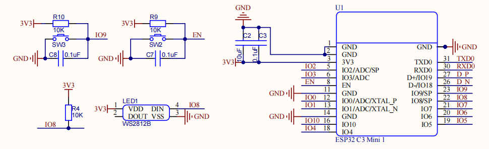
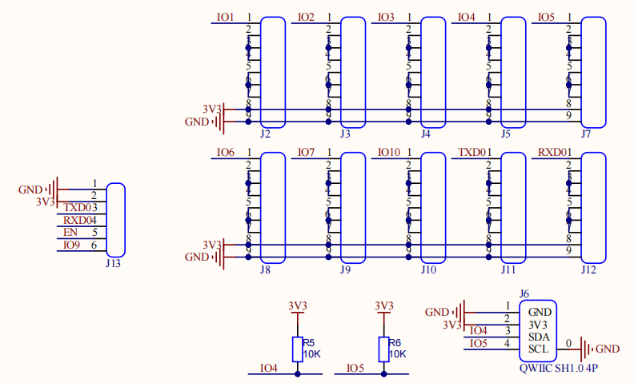

.. _hardware:

Hardware
====================================

TODO

Pin Assignment
------------------------------------

General Pins

.. table
    :widths: 20, 30
    :align: left
  
    +-----------+------------------+
    | ESP32 S3  | General          |
    +===========+==================+
    | GPIO11    | MOSI             |
    +-----------+------------------+
    | GPIO13    | MISO             |
    +-----------+------------------+
    | GPIO12    | SCLK             |
    +-----------+------------------+
    | GPIO4     | SDA              |
    +-----------+------------------+
    | GPIO5     | SCL              |
    +-----------+------------------+
    | GPIO1     | Battery Level    |
    +-----------+------------------+
    | GPIO2     | Charge Detect    |
    +-----------+------------------+
    | GPIO0     | Switch           |
    +-----------+------------------+
    | GPIO10    | TFT CS           |
    +-----------+------------------+
    | GPIO9     | TFT D/C          |
    +-----------+------------------+
    | GPIO14    | TFT Reset        |
    +-----------+------------------+
    | GPIO48    | TFT Backlight*   |
    +-----------+------------------+
    | GPIO21    | uSD CS           |
    +-----------+------------------+
    | GPIO47    | uSD Card Detect* |
    +-----------+------------------+

LCD Pins

.. table
    :widths: 20, 30
    :align: left
  
    +-----------+---------------+
    | ESP32 S3  | LCD           |
    +===========+===============+
    | GPIO11    | MOSI          |
    +-----------+---------------+
    | GPIO13    | MISO          |
    +-----------+---------------+
    | GPIO12    | SCLK          |
    +-----------+---------------+
    | GPIO10    | CS            |
    +-----------+---------------+
    | GPIO9     | D/C           |
    +-----------+---------------+
    | GPIO14    | Reset         |
    +-----------+---------------+
    | GPIO48    | Backlight*    |
    +-----------+---------------+

FT6206 Touch Screeen Pins

.. table
    :widths: 20, 30
    :align: left
  
    +-----------+---------------+
    | ESP32 S3  | FT6206        |
    +===========+===============+
    | GPIO4     | SDA           |
    +-----------+---------------+
    | GPIO5     | SCL           |
    +-----------+---------------+

Micro SD Card Pins

.. table
    :widths: 20, 30
    :align: left
  
    +-----------+---------------+
    | ESP32 S3  | Micro SD Card |
    +===========+===============+
    | GPIO11    | MOSI          |
    +-----------+---------------+
    | GPIO13    | MISO          |
    +-----------+---------------+
    | GPIO12    | SCLK          |
    +-----------+---------------+
    | GPIO21    | CS            |
    +-----------+---------------+
    | GPIO47    | Card Detect*  |
    +-----------+---------------+

> * is optional by solder pad. See ..Solder Pad.

Power management
----------------

Power includes 2 inputs: 5V USB Type C and 3 AAA batteries, joined together with a simple power selector, which cuts of the batteries when USB is pluged in. A 3.3V power indicator LED(D2) to indicate the power status. A 50:50 voltage divider to devide the battery voltage to IO0.

ESP32 C3
----------------

Simple setup for ESP32 C3 with WS2812B(IO8) and buttons(IO9 and EN).

Sensor connectors
----------------

Sensor connectors consist of Proto Area, QWIIC connector and UART flash connector.

Proto Area
----------------

Proto Area is a small area on the top of the Sense Node C3, like a little bread board. the pin holes are connected as the silk screen printed for easy wiring. DONOT CONNECT THE 3V3 AND GND TOGETHER!
