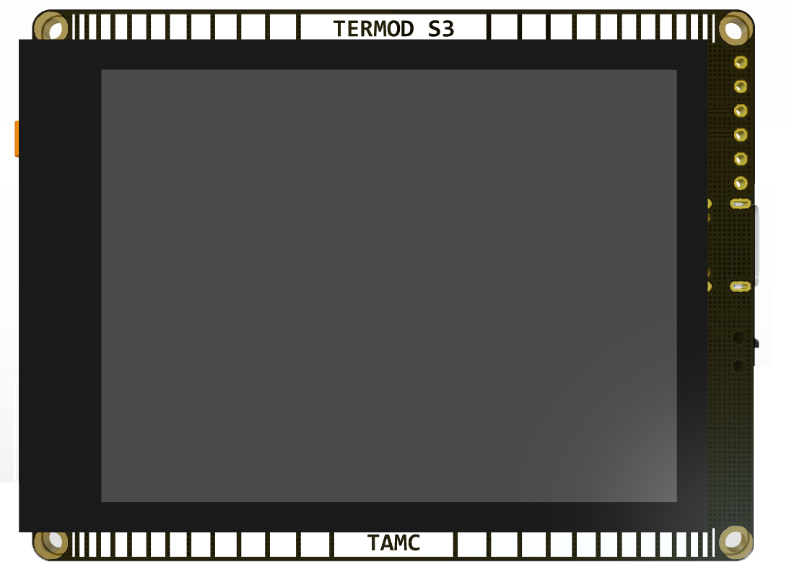

Termod S3
====================================

Termod S3 is a ESP32 S3 development board with 2.8 inch capacitive touch diaplay. 

Specifications
-------------

.. table::
   :widths: 20, 30
   :align: left

   +----------------+-----------------------------+
   | Power          | USB: 5V; Battery: 3.3V-4.2V |
   +----------------+-----------------------------+
   | MCU            | ESP32 S3                    |
   +----------------+-----------------------------+
   | Flash          | 8 M                         |
   +----------------+-----------------------------+
   | PSRAM          | 2 M                         |
   +----------------+-----------------------------+
   | Display        | 2.8 Inch 320x240 IPS        |
   +----------------+-----------------------------+
   | Touch          | FT6206 Capacitive IIC       |
   +----------------+-----------------------------+
   | Size           | 76x58mm                     |
   +----------------+-----------------------------+
   | Mounting Holes | M2 x 4                      |
   +----------------+-----------------------------+

.. toctree::
   :maxdepth: 3

   hardware
   arduino-usage/index
   edf-idf-usage/index
   faq
