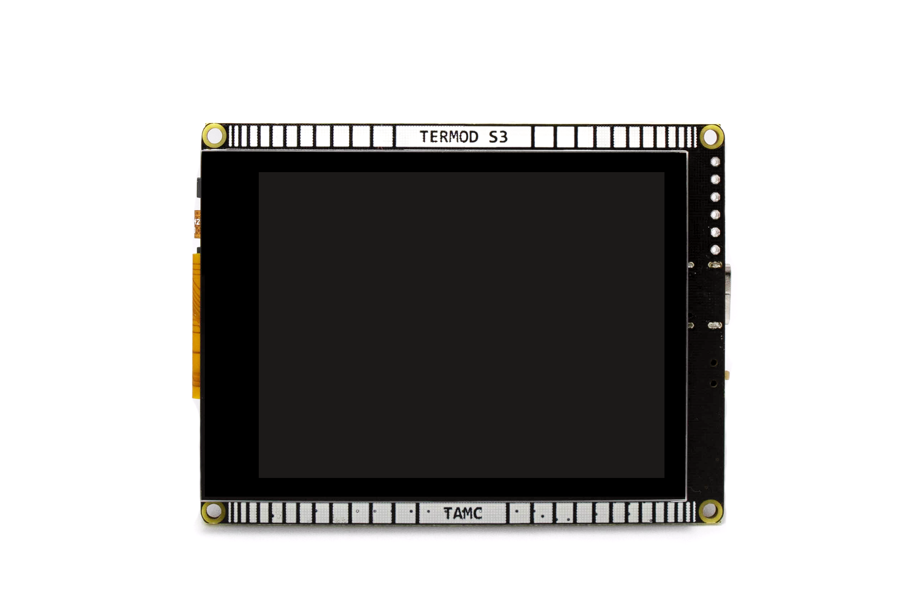
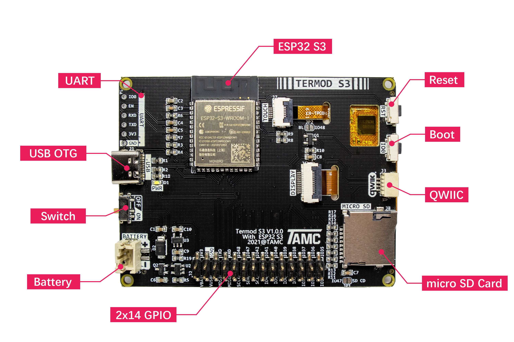

Termod S3
====================================

Termod S3 is a ESP32 S3 development board with 2.8 inch capacitive touch diaplay. 

Specifications
---------------------------

.. table::

   +----------------+-----------------------------------+
   | Power          | PH2.0 2P, 3.3V-6V, Min 3.55V@600mA|
   +----------------+-----------------------------------+
   | USB            | USB 2.0 Type-C, PD 5V             |
   +----------------+-----------------------------------+
   | MCU            | ESP32 S3                          |
   +----------------+-----------------------------------+
   | Flash          | 8MB                               |
   +----------------+-----------------------------------+
   | PSRAM          | 2MB                               |
   +----------------+-----------------------------------+
   | Display        | 2.8 Inch 320x240 IPS, SPI         |
   +----------------+-----------------------------------+
   | Touch          | FT6206 Capacitive IIC             |
   +----------------+-----------------------------------+
   | Size           | 76x58mm                           |
   +----------------+-----------------------------------+
   | Mounting Holes | M2 x 4                            |
   +----------------+-----------------------------------+

.. toctree::
   :maxdepth: 3

   hardware
   arduino-usage/index
   esp-idf-usage/index
   faq
